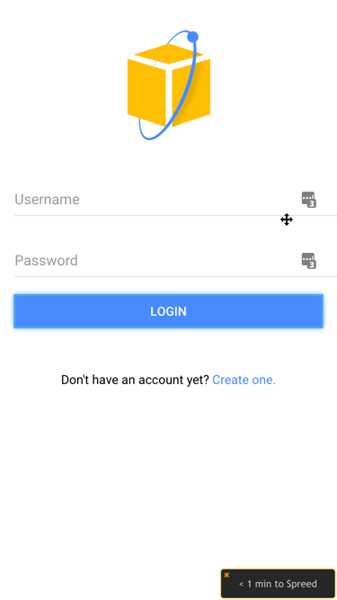

# IonicAWS

You can check out the live demo of the app [here](http://ionicaws-hosting-mobilehub-1643446370.s3-website-us-east-1.amazonaws.com/), or read a free 3k+ word tutorial on how to create this step by step [here](http://www.nikola-breznjak.com/blog/).